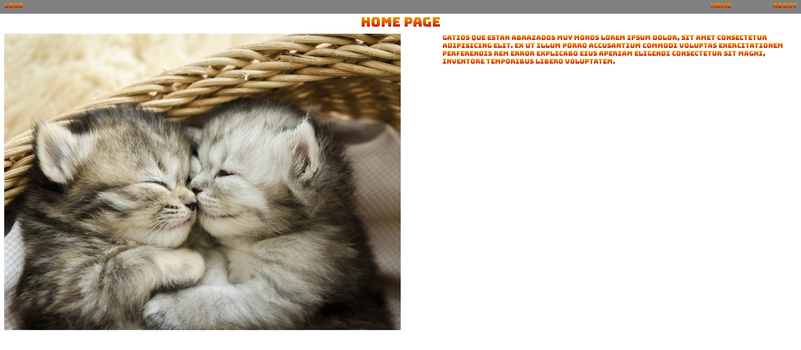

# Mi página web

Esta es una página que he hecho para prácticar flex.

## Tecnologías que he utilizado 🛠️

Este proyecto ha sido hecho utilizando HTML y CSS (con flexbox) 

#### Preview
Vista home

 

---
Hecho por [Sofía Pinilla](https://github.com/SofiaPinilla) 😊